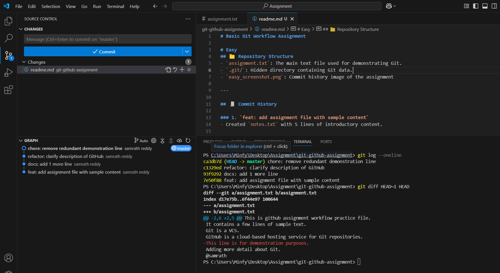
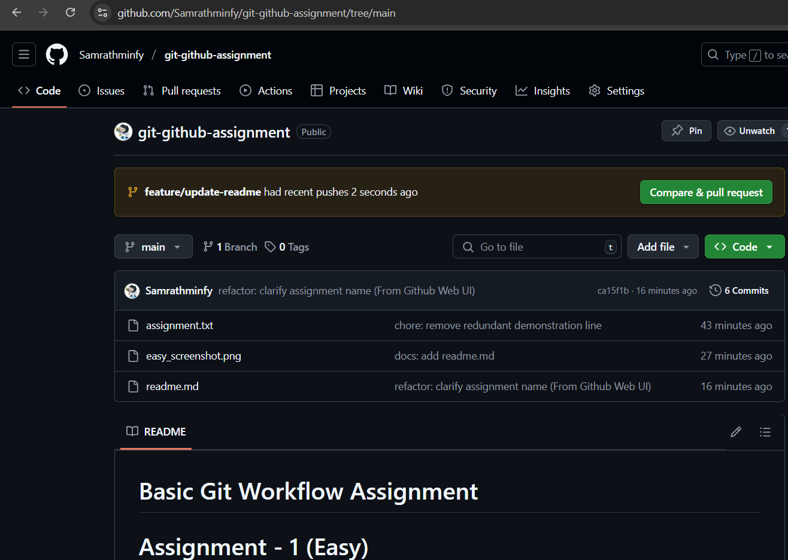
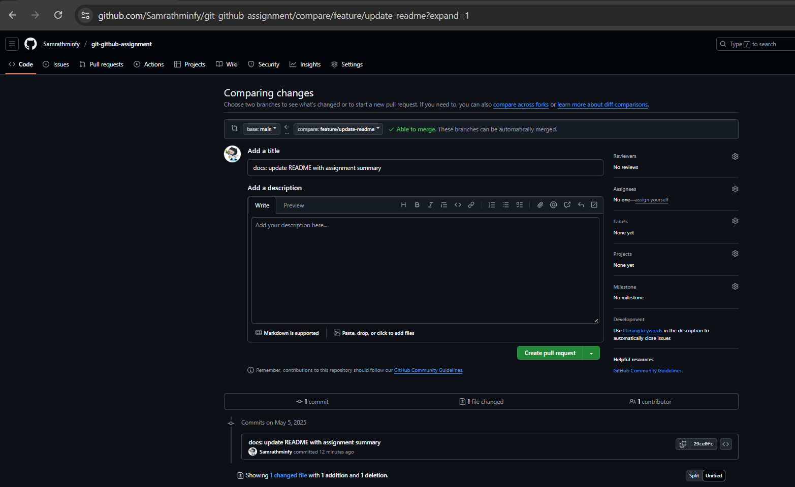

# Basic Git Workflow Assignment

# Assignment - 1 Summary (Easy)
## 📁 Repository Structure
- `assignment.txt`: The main text file used for demonstrating Git.
- `.git/`: Hidden directory containing Git data.
- `easy_screenshot.png`: Commit history image of the assignment

---

## 🧾 Commit History

### 1. `feat: add assignment file with sample content`
- Created `assignment.txt` with 5 lines of introductory content.

### 2. `docs: add 1 more line`
- Added a line elaborating on Git's capabilities.

### 3. `refactor: clarify description of GitHub`
- Reworded the GitHub description to make it clearer and more accurate.

### 4. `chore: remove redundant demonstration line`
- Removed a line that was no longer needed after editing.

---

## 🖼️ Screenshot of `git log`


---

## 🔍 Git Diff Example
Run this command to view the most recent change:
```bash
git log --oneline
git diff HEAD~1 HEAD
```

---
# ✅ Assignment - 2 Summary (GitHub Basics & Collaboration)

## 🌐 GitHub Repository Link
[GitHub Repository](https://github.com/Samrathminfy/git-github-assignment)

---

## 🔧 GitHub Collaboration Steps

1. Created a new repository on GitHub.
2. Pushed the local repository from Assignment 1 to GitHub using `git push`.
3. Update a `README.md` file directly on GitHub via the web interface.
4. Pulled the new `README.md` to the local machine using `git pull`.
5. Created a new branch `feature/update-readme`.
6. Made updates to the `README.md` file with Assignment 2 summary.
7. Pushed the branch to GitHub.
8. Opened a Pull Request from `feature/update-readme` to `main`.
9. Reviewed and successfully merged the Pull Request on GitHub.

---

## 🖼️ Pull Request Screenshot


---

## 📌 Notes
- This assignment demonstrates the complete cycle of local Git usage and remote GitHub collaboration.
- It covers repository creation, pushing, branching, pull requests, and merging.
